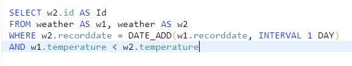
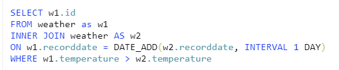

# SQL #

**1. LEETCODE practice**
- [Question1](https://leetcode.com/problems/classes-more-than-5-students/)
- [Question2](https://leetcode.com/problems/big-countries/)
- [Question3](https://leetcode.com/problems/not-boring-movies/)
- [Question4](https://leetcode.com/problems/rising-temperature/submissions/) 
- For Question4 , there are several possible answers as below

**2. Study with MOOC**
- [LINK](https://www.notion.so/MOOC-69a40a62c1f64e8d838ed39bd658d9e1_)
- If apply for financial-aid with self-introduction, can use for free
- when completing with reasonable score, certification will be given 
- check the recommanding list from Sunmi
- Programming for everybody -> good for Python starter