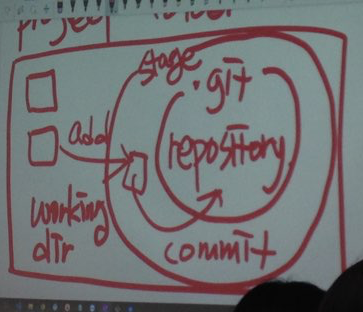
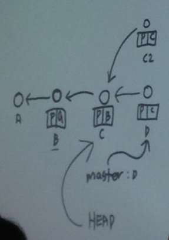

### 지옥에서 온 git, 왜 지옥인가?
- git을 만든 사람=리눅스 만든 사람 said, “Git is information manager from hell”
- (리눅스 프로젝트: 30년간 지속, 2천만 줄의 코드)
- 나의 문제 > 공부의 어려움 -> 공부는 구원
- 나의 문제 < 공부의 어려움 -> 공부는 지옥
- 나의 문제 = 공부의 어려움	-> 이상적
- "공부 = 나의 문제 * 상상력"이 되어야 한다.

 

### Git이란?
- "파일 이름을 더럽히지 않고 버전 관리 하는 법"에 대한 프로그래머의 고민으로부터 나온 결과물
- Git은 이 분야의 4세대 프로그램 중 최강자
- 가장 중요한 것: 버전 만들기!

 

### Sourcetree 로 git 사용하기
- 버전: 변경사항을 반영한 것. 워킹카피의 스냅샷.
- 하나의 버전에 복수 개의 파일을 포함시키려면? 
    1. stage area에 파일을 올린다.
    2. 포함할 파일 체크헤서 동시에 커밋
    * 노란색 아이콘: 한 번 이상 커밋된 파일
    * 보라색 아이콘: 아직 커밋 안 된 파일


- 한 번 커밋되면 돌이킬 수 없다.

- 과거 버전을 더블클릭, 또는 오른쪽클릭>체크아웃 하면 디렉토리 파일 제거/생성되면서 그 버전으로 돌아감.

- git 폴더 덕분에 git은 안전함. 실험 전에 불안하다면 작업 폴더의 카피본을 만들어 놔라.

- 각 커밋마다 고유의 커밋 id가 있다.

- git과 블록체인의 구조가 거의 같다.

 

# HEAD 와 Master

### 오늘 수업의 주인공 HEAD
- 나의 워킹카피가 어느 버전에서 유래했는가를 가리킴 
- **git을 켜면 헤드부터 찾아야 함!!!**

### 내일 수업의 주인공 Master
- 최종 커밋 버전(마지막으로 만든 버전)을 가리킴
- Head != master 일 때 -> "head가 master로부터 detached (떨어져있다)" 

### Checkout
- ***“체크아웃은 헤드를 옮긴다.”*** 
- 시간여행을 끝낼 때는 마스터를 체크아웃 -> 이거 안한 상태에서 수정하면 헤드가 가리킨 버전 위에 수정되어서 커밋됨

### Reset
- ***"리셋은 마스터(헤드가 가리키는 브랜치)를 옮긴다."***
- 리셋 방법: 오른쪽 클릭> master를 이 커밋으로 초기화
- 리셋은 delete와는 다름

 

## Command Line 명령어

### visual studio code 설정 
1. command+J 로 터미널 켜기
2. view>command palette
3. terminal: select default shell
4. bash (터미널의 타입 설정)
5. +(default로 설정한 bash terminal 켜짐)

### 명령어
- pwd : 현재 내 위치 확인 (제일 먼저 할 일)
- git init : 현재 위치 안에 .git 폴더 만들기
- ls : 현 위치에 있는 파일 목록 확인
- ls -l : 파일 목록 자세히 보기
- ls -l -a : 숨김 파일(.git) 까지 다 보기
- ls -al : 숨김 파일(.git) 까지 다 보기 (결과로 나온 파일명의 맨 앞에 d 있으면 directory)
- git status : 파일 상태 확인
- git add 파일명 : stage area에 올리기 (소스트리에서 파일에 체크 누른 것과 같음)
- git commit -m “커밋메시지” : “커밋메시지” 와 함께 커밋
- git diff : 수정사항 보여줌 (수정 후 add 전에)
- git log : 커밋 내역 보여줌. 밖으로 나갈 때는 q 누르기.
- git log -—oneline : 커밋 내역을 각각 한 줄로 보여줌 (head가 가리키는 것까지만 보여줌)
- git log -—oneline -—all : 커밋 내역을 각각 한 줄로 보여줌 (head, master 등 전부 보여줌)
- git checkout id(7글자) : 해당 버전으로 체크아웃
- git checkout master : master로 체크아웃
- git reset -—hard id(7글자) : id로 master 설정 / 지워진 파일 id를 넣으면 그걸로 master 설정 되며 파일 다시 살아남.
- git reflog : head, master 설정 내역 모두 보여줌. 지워졌던 파일 id 확인 가능.

