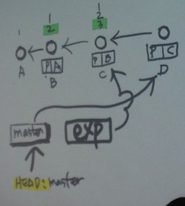
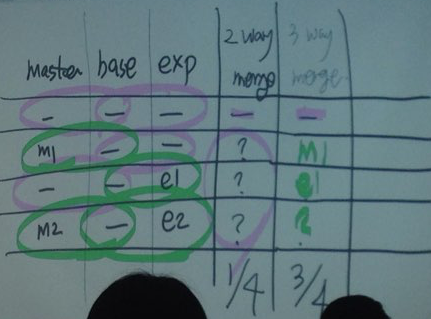

### Command Line 명령어
- mkdir 폴더명 : 폴더 만들기 (make directory)
- touch 파일명 : 파일 만들기
- cd 폴더명(상대경로)/절대경로 : 폴더로 이동 (change directory)
- ./ : 현재 폴더
- .. : 상위 폴더
- /. : 최상위 폴더 (루트 디렉토리)
- cd .. : (상대경로 이용해서) 상위 폴더로 이동
- cd ../.. :  상위의 상위 폴더로 이동
- rm -r 폴더명 : 폴더 삭제 (-r: recursive 재귀적인 -> 디렉토리 안에 있는 파일까지 다 지워라)
- rm -rf / : 인생 망하는 길.. 절대 하지마... /가 루트 디렉토리라서 이거 하면 전부 다 지워짐
- git add . : 현재 디렉토리의 모든 파일을 stage area에 올림
- git commit -a -m “커밋메시지” : add 하면서 commit 하기 
- git commit -am “커밋메시지” : add 하면서 commit 하기
- clear : 터미널 입력창 모두 지우기
- ctrl+c : 입력 모드로 됐을 때 나가기
- git checkout ID : head를 ID로 옮기기 -> 시간여행 시작
- git checkout master : head를 master를 가리키도록 -> 시간여행 끝
- git reset ID : head가 가리키는 branch를 ID로 옮기기. ID가 마지막 버전이 되며 그 이후 버전들은 사라지는 듯한 효과.

 

### git add의 의미
1. stage에 올린다.
2. tracked 상태로 바꾼다.
3. 안전장치

 

### 특정 파일을 git status 에 표시 안되게 하려면
1. 폴더 안에 .gitignore 파일을 만든다.
2. 그 파일에 ignore 시킬 파일명을 적는다. ex) password.txt
3. gitignore 파일을 커밋한다.

 

# branch

구조: branch - trunk - root

branch는 master와 같은 레벨

**git branch** : branch의 리스트를 보여줌

**git branch exp** : exp라는 파일명의 branch를 만듦. 브랜치를 만드는 시점의 버전에 exp를 고정시킴. 그 이후의 버전으로 이동해도 exp는 옮겨지지 않고 master만 옮겨짐.

**git checkout exp** : (exp 버전으로부터 작업하기 위해) head를 exp로 옮김

**git checkout -b exp** : exp branch 만들고 checkout까지 한번에

**git log --oneline --all --graph** : 가지 모양까지 포함해 로그를 보여줌

**git log --oneline --graph** : —all을 빼면 지금 가리키고 있는 브랜치의 역사만 보여줌 (exp를 가리키고 있다면 master꺼는 안 보여줌)

**git diff-tree --no-commit-id --name-only -r ID** : 버전(ID) 안에 무슨 파일 있는지 볼 떄

**git branch -D 이름** : 브랜치 삭제

 

## merge (병합)

master로 exp에서 작업했던 것들을 병합할 때
    1. 마스터로 체크아웃한다.
    2. 마스터로 exp를 병합한다.

git은 merge를 위해 버전들을 비교할 때 2-3줄 씩 뭉탱이로 비교한다.

 

### **2 way merge**

work.txt : master | work.txt : exp
-|-
- | -
m1 | -
- | e1
m2 | e2
-> 4번째 줄에서 conflict(충돌)!!

충돌 해결 방법
- 소스트리: work.txt 오른쪽 클릭 > 충돌 해결하기 > 해결된 것으로 표시 (mark resolved) > 커밋
- command line: git status > git add work.txt > git commit

**git merge —abort** : 충돌 취소할 때 command line 명령어

 

### **3 way merge**
 
base(원본 파일)을 참고해서 수정된 부분 기준으로 병합하는 방법

