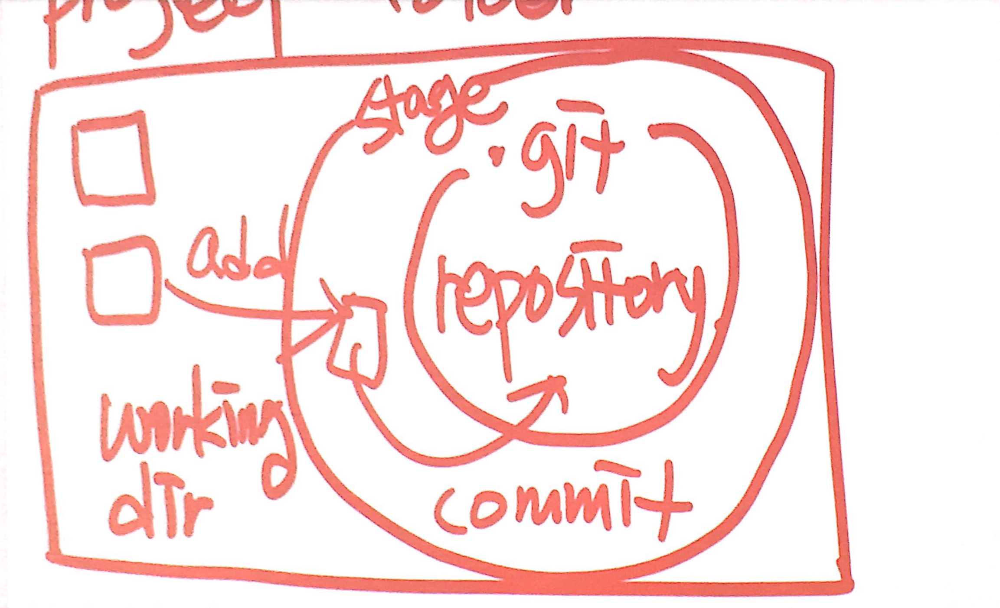
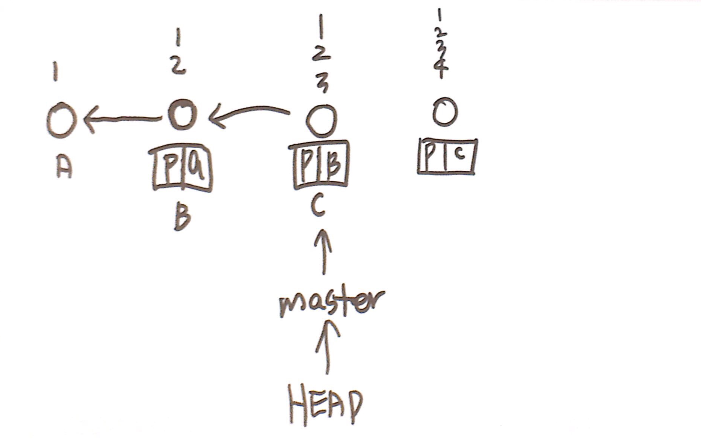
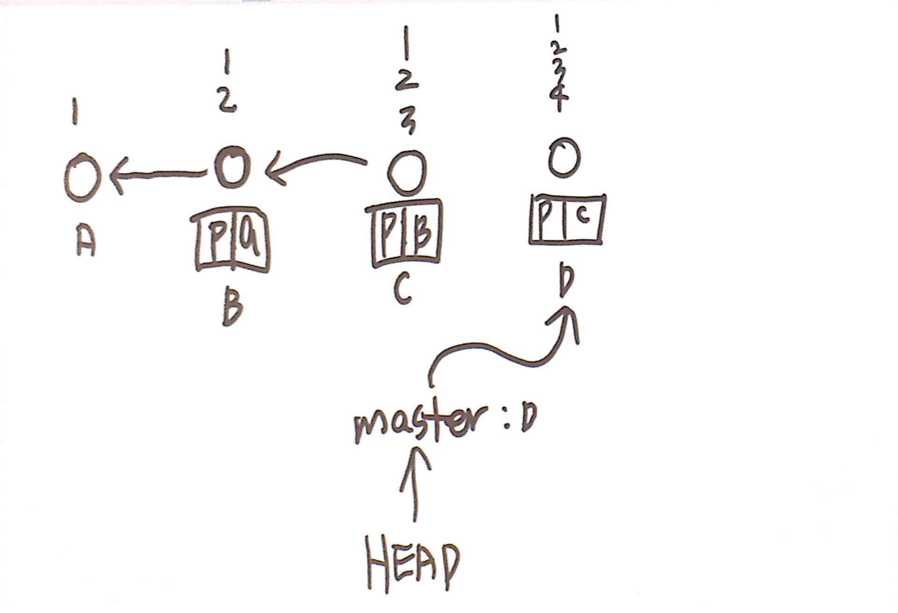
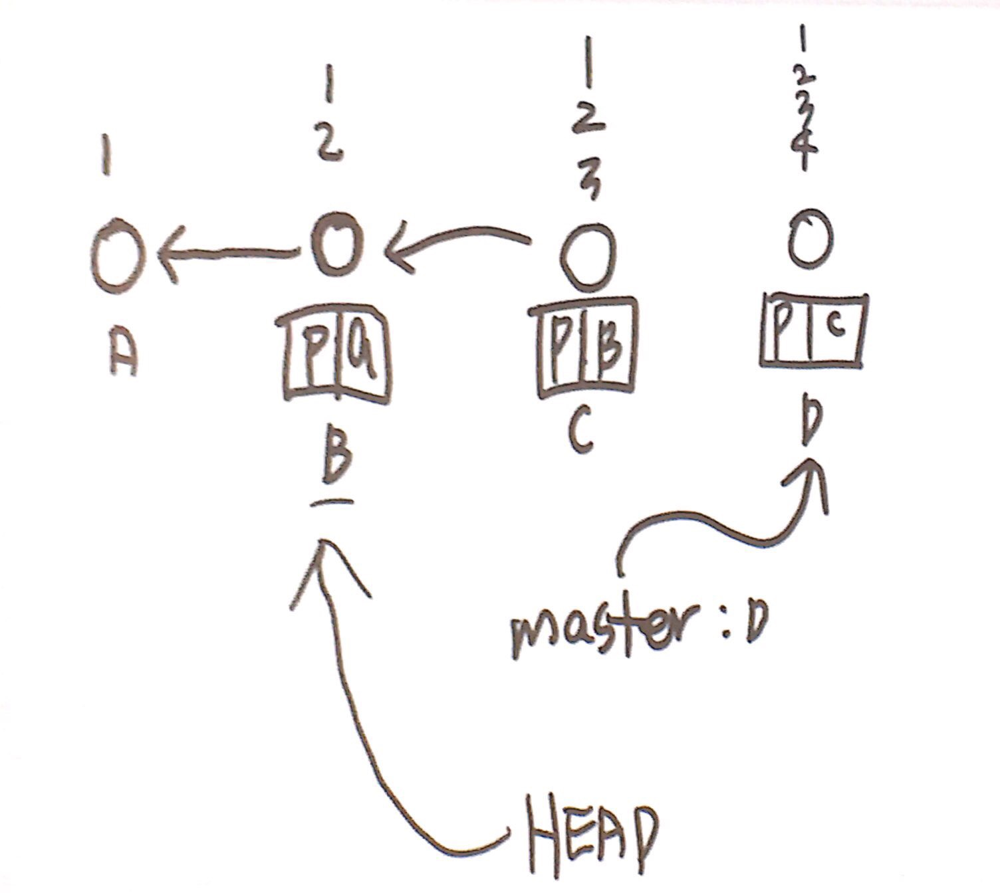
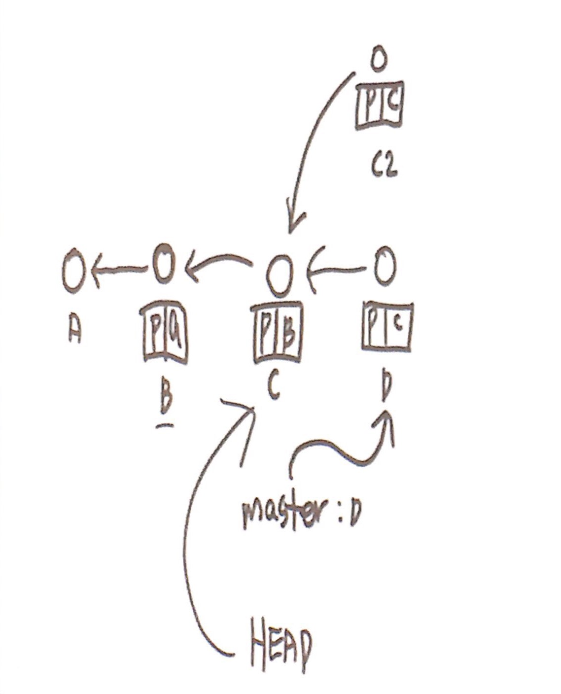
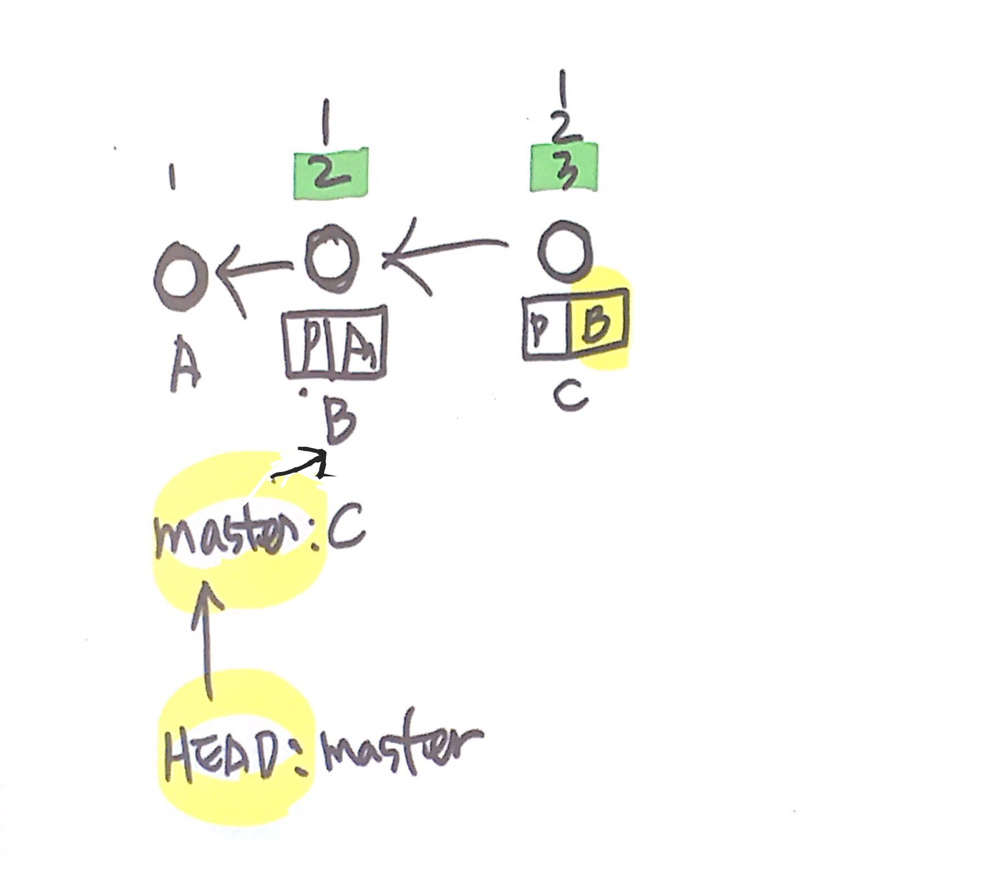

# 지옥에서 온 깃Git (1/3) 2019-07-29 이고잉님

### Git: 버전관리 시스템

: 기능이 많아서 사용성 떨어짐

`"소프트웨어는 인간이 수동으로 할 수 있는 일을 자동화하는 것"`

코드 = 문서

ex. 경기문화재단 

시스템 구축할 필요없이 Git 쓰시라

### 기존 버전 관리 방법

`work.txt`

`work-최종.txt`

`work-최종-최종.txt`

`work-최종-최종-최종.txt`

: 버전에 대한 정보를 파일명에 넣는다

: 복잡하고 한계가 있다

**dropbox** 

: Git 을 일반인이 사용할 수 있게 한 서비스

: 업로드시 각 버전이 만들어져서 올라가고 한달간 보관됨

장점: 신경 안 써도 바로 아카이빙된다

단점: 쓸모없다

**Sourcetree** 

폴더를 레포지토리로 설정하면 → 폴더 내 .git 이라는 숨김 디렉토리 생성된다

: self-contained그 안에 필요한 모든 정보 들어있음

portable

**IT 의 네가지 operation, CRUD**

C : Create

R : Read

U : Update

D : Delete

Stage Area

하나의 버전에서 여러가지 파일이 수정되었을 때

버전관리하라고 하기 전까지 하지 않는다

### **Project Folder 프로젝트 폴더**

- .git Directory 디렉토리: 리포지토리 Repository
- 나머지 폴더: 워킹 디렉토리 Working Directory
- Stage Area: .git Dir 포함하는 범위
- Add : 이번 버전이 될 워킹 디렉토리를 스테이지에 올리는 것
- Commit: stage 에서 repository 로 가는 과정

### 시간 여행: 체크아웃

History-master 에서 각 버전을 더블클릭/마우스 우클릭-체크아웃 하면 

해당 버전이 만들어진 시점으로 프로젝트 폴더 전체가 바뀐다

: 모든 파일이 커밋된 상태여야 가능 

체크아웃Check-out은 헤드Head를 옮긴다

master를 누르면 최신버전으로 복귀하고, 헤드Head는 master를 가리킨다

클론 생성: 디렉토리를 initialize 했다.

- 커밋하지 않은 변경사항 있을 때 Working Directory 에 있는 파일

마우스 우클릭 - 폐기 Discard `(cf. 제거 Remove)`

- 실수로 파일을 지웠을 때

마우스 우클릭 - 폐기(초기화) Discard

각각의 커밋Commit 은 커밋 아이디Commit ID 로 식별

각 커밋의 부모Parent 가 누구인지도 적혀있음

블록체인과 구조가 똑같다

- master: 나의 최신 commit
- head: 나의 working copy 가 어느 버전에서 유래했는가
- 버전version: 스냅샷

☞ A, B, C 순서대로 Commit 한 경우 master: C, Head: C

☞ version D 로 커밋하면 master: D, Head: D 

☞ version B 로 체크아웃하면, master: D, Head: B 

- Detached Head: Head 가 master 로부터 떨어진 것

☞ master 로 체크아웃 하지 않고(Head: C 인 상태에서) 바로 커밋하면,

체크아웃했던 version C 로부터 version C2 가 생성된다

☞ 여기서 master 로 체크아웃하면 version C2 는 히스토리에서 보이지 않는다

☞ 그래서 항상 master 로 체크아웃하고 새로운 version 을 만들자

### Git 저장소 상태 확인할 때

Head 확인 → master 확인 → master 가 가리키는 버전 확인

`Q. version C, version D 를 지우고 싶다면?`

`A. master 를 version B 로 옮긴다(초기화reset)`

- 초기화Reset

    : master 를 옮긴다

    : Head 가 가리키는 Branch 를 바꾼다

- soft/mixed/hard: 뭔지 모를 때까지는 hard 선택

### 삭제한 파일 Reset 되돌리기

- 커밋 아이디를 따로 기록한다
- 터미널에서 커밋아이디 이용해서 복구한다

`git reset —hard (커밋 아이디)`

- 파일 삭제해도 복구할 수 있는 이유와 같다.
- 리얼 삭제하려면 덮어써야함

`CLI Command Line Interface: 터미널 화면` `by 키보드, 시리`

`GUI Graphical User Interface: 마우스로 클릭 by 마우스, 터치`

`*Interface: 조작장치`

GUI 를 구현하기 위해 컴퓨팅 파워의 7-80%  를 사용한다, 서버 컴퓨터는 CLI 로만 조작가능

### CLI: Command Line Interface 쓰기

Visual Studio Code

`Ctrl + J` 

: 터미널 화면 켜기

View - Terminal : Select Default Shell - Git Bash

아래 터미널 화면에서 + 버튼 클릭

html: 웹페이지의 확장자

### 터미널 명령어 입력하기

`git`

`pwd`: 현재 위치를 확인

`git init` : 저장소Repository 를 만든다  .git 폴더를 만든다

`ls` : 리스트List 

`ls -l` : 리스트의 자세한 정보 최신

`ls -l -a = ls-al` : 자세한 정보 전부

-하이픈 뒤에 옵션을 붙여서 명령

`git status` : 현재 상태 확인, git 내에서 pwd 와 같은 역할

`git add index.html(파일명)` : Add 해당 파일을 스테이지로 올린다

`git commit` : Commit 한다. 복잡한 대화창이 뜰 수 있어서 바로 쓰지 않는다

`git commit -m "work 1"(해당 버전 설명)` 

`-m` : "메세지까지 여기서 다 입력한다" 는 뜻

`git diff` : 수정 후 add 전에 보면 이전 버전과 달라진 부분 나온다

`git add index.html(파일명1) index2.html(파일명2)` : 2개 이상 파일 나열하면 한꺼번에 Add 된다

`git log` : commit 간의 관계 보기, Head, master 포함

`git log —oneline` : log 를 한 줄로 보기

`git checkout (log 에서 확인했던 commit ID 앞 7자리 입력)` : 해당 commit ID 로 Head 가 이동한다(시간여행)

`git log —oneline —all` : Head 와 master 가 Detached 상태일 때 전체 log 확인 가능

`git reset —hard (commit ID)` : reset

`git reflog` : 엄청난 애

Git 의 특징

1. 안 지운다
2. 모두 기록한다
3. 

### 태그Tag

`<i> </i> 이탤릭italic`

`<u> </u> 밑줄underline`

`  줄바꿈`

### 입력 안 될 때

shift + :  End 어쩌고 

Q : 빠져 나가기

# 지옥에서 온 깃Git (2/3) 2019-07-30 이고잉님

구글에서 `git cheat sheet` 검색해서 편한거 찾아 쓴다

`IDE integrated Development Environment 통합 개발 환경` : Visual Studio Code 는 IDE 프로그램

`에디터Editor`: 편집기능만 있는 프로그램

TIP) Command Line 에서 작업하는 명령어 

`mkdir (폴더명)` : **m**a**k**e **dir**ectory, CLI 에서 폴더 만들기

`cd (폴더명)` : **c**hange **d**irectory, 원하는 폴더로 들어가기(현재 위치한 디렉토리를 바꾸기)

`cd (폴더 경로 전체 c/Users/minju/desktop/working3` : 절대경로를 이용해 폴더 이동하기

`cd ..` : 현재 디렉토리의 부모 디렉토리로 이동, 상대경로

`..` : 현재 디렉토리의 부모 디렉토리

`.` : 현재 디렉토리, 나 자신

`/` : 루트 디렉토리(전체)

`cd ./hello-dir` = `cd hello-dir`

`cd ../../../` : 부모의 부모의 부모로 계속 올라갈 수 있다

    bash 옆에 + 누르면 처음 지정했던 디렉토리로 바로 갈 수 있다

`ls` : 현재 디렉토리의 파일 리스트 보기

`rm (파일명)` : 파일 지운다

`rm -r (폴더명)` : recusive 폴더 지우려면 -r 해야 지워진다

`rm -rf (폴더명)` : force 묻지도 따지지도 말고 지워라

`rm -rf /` : 전체 (루트) 디렉토리를 지운다

`rm -rf ./` : 현재 디렉토리를 지운다

`git init ./(폴더명)` : 입력한 폴더명으로 폴더를 만들고 거기에 .git 폴더를 만들어라

`git add ./` = `git add .` : 현재 디렉토리의 모든 파일을 Add

`git commit -m "work 2" -a`

`git commit -a -m "work 2"`

`git commit -am "work 2"` : add 따로 하지 않고 바로 commit

`Ctrl + C` :캔슬

**password 같은 파일이 자동으로 add 되게 하지 않게 하려면**

    .gitignore 라는 폴더를 만든다
    그 폴더 안에 add 하지 않을 폴더명을 쓴다

    add: stage 에 올린다
    	 : tracked 상태로 바꾼다

아이디 패스워드 양식은 필요할 때

: 양식만 가지고 있는 파일을 커밋

Commit : 현재 working copy 의 스냅샷을 freezing 

**Parent 를 결정하는 방법**

: Head 가 가리키는 파일이 Parent

: 블록체인처럼 정보가 새겨져있다

**지우고 싶을 때**

: master 를 옮긴다 `git reset -—hard (commit ID)` 

# Branch

root / trunk / branch : 은유적 표현

    **master**: Default Branch
    
    ☞ 새로운 Branch 를 만들 수 있다
    
    ☞ 협업하려면 Branch 가 필요하다

`git branch` : 현재 있는 모든 Branch 보여준다

`git branch (Branch 이름)` : 입력한 이름의 새로운 Branch 생성

`git checkout exp(새로 생성한 Branch 이름)` : 해당 Branch 로 Head 가 이동한다

`git checkout -b exp(새로운 Branch 이름)` : exp 라는 새로운 Branch 만들고 checkout 까지 한다

`git branch -d exp2` : Branch 지우기, ****지우려는 해당 Branch 에서 나와서

`git log —oneline —all —graph` : Branch 가 갈라진 것을 그림으로 볼 수 있다

`git log —oneline -graph` : -all 을 제외하고 쓰면 현재 Branch 만 보인다

**지난 version 에서 다시 작업하고싶을 때**

`git checkout (이동 원하는 버전 ID)`

`git branch (새 Branch 이름)` : "Head, (새 Branch 이름)" 새 Branch 생성

`git checkout (새 Branch 이름)` : "Head → (새 Branch 이름)" Head 가 새 Branch 를 가리킨다

`"Head, (새 Branch 이름)"` 인 상태일 때 commit 하면 만들어진 새 버전은 Head 만 가리킨다. 새 Branch 는 그 부모버전에 머물러 있음

# 병합Merge

master 와 exp 를 병합한 working copy 를 만든다: 각자의 길을 간 애들이 합쳐짐(자동으로)

master 와 exp 모두가 부모 디렉토리가 된다

exp 에서 작업한 것을 master 로 병합

: master 로 체크아웃`git checkout master` → master 로 exp 를 병합`git merge exp`

: commit message 도 자동으로 생성

-m 은 한 줄만 쓸 수 있음

-m 안쓰면 commit message 를 쓸 수 있는 visual studio code Editor가 뜬다, 길게 쓸 수 있다

**Commit Message 를 입력하는 Editor 를 통일하기 (Default Editor)**

`code` : 현재 기본 설정된 Editor 확인

**git 이 어디까지 자동으로 병합해주나**

- 각각 다른 부분이 수정된 경우 : 알아서 병합해준다
    - 공통의 Parent 를 찾아서 Base 로 설정한다.
    - 병합하는 파일 2개와 Base 파일 하나 총 3개를 비교해서 병합한다 `3-Way-Merge`
- 같은 부분이 수정되어 있으면 : conflict 충돌 메세지 뜨고 수동으로 수정해야한다

**3-Way Merge**

- 수동으로 충돌 해결 후
    - **SourceTree 에서 해결**

    : 마우스 우클릭 - 충돌해결 - 해결된 것으로 표시

    - **Terminal 에서 해결**

    : add 후 commit

    `git add (파일명)`

    `git commit -m "commit message"`

- 내 것으로 해결
- 저장소 것으로 해결

`git add (병합파일명)` : 해결 한 후 add 한다

 

`git merge --abort` : 병합 전 상태로 되돌리기

> "엔지니어는 적당한 비극 속에서 피어나는 꽃"

# 운영체제 Window/Unix

- 운영체제끼리 사용하는 명령어가 같다
- 우리가 배운 것은 Unix 에서 사용하는 명령어

    `Unix : Linux, Mac 등` 

- Emulator : Unix 에서 사용하는 명령어를 Window 에서도 사용하게 해주는 프로그램 `ex. git bash`

# 지옥에서 온 깃Git (3/3) 2019-07-31 이고잉님

gistory : .git 파일에서 어떤 일이 일어나는지 웹으로 볼 수 있게 해준다

`pip install gistory` : gistory 설치 방법

### Commit ID

[git hash generator site](http://www.sha1-online.com/)

: 단방향 암호화

: 같은 내용에는 같은 암호가 생성된다

`curl (웹페이지 주소)` : 해당 웹 html 가져오기

`301 Moved Permanently` : 차단 메세지

curl like chrome 으로 검색해서 찾는다

`ls` : 리스트가 Command 라인에 나온다

`ls > ls.txt` : 리스트가 파일로 저장된다

`(code) ; (code)` :  앞 코드 성공여부와 상관없이 순서대로 실행

`(code) && (code)` : 앞 코드가 성공하면 뒤 코드 실행

### 더 간단한 방법

1. sync.sh 파일 만들어서 파일에 위의 curl 코드를 넣고 저장한다
2. `bash sync.sh` 실행시키면 똑같이 된다
3. sync.sh 파일 내에서는 && 연산자 대신 줄바꿈만 해주어도 똑같다
4. 자동으로 만들기
    - sync.sh 파일 내용 수정

    while true
    do
    (code)
    sleep 5 
    done

- `Ctrl + C` 하면 루프 빠져나온다
- `sleep 5` : 5초 동안 쉰다

                   : 실제로는 5분, 10분 정도 단위로 늘려서 할 것(차단당한다)

`(명령어) —help` : Command Line 시스템에서는 뒤에 —help 붙이면 도움말

VI : Command Line 시스템에서 메모장/Visual Studio Code 와 같은 Editor 기능을 한다

: 마우스가 없을 때 만들어짐

`vi work2.txt` : VI Editor 에서 work2.txt 라는 파일을 만들겠다

`i` 눌러야 입력된다

`Ctrl + C` : 명령어 입력

`dd` : 삭제

`: + W + Enter` : 저장

`: + Q + Enter` : 종료

`: + WQ + Enter` : 저장 후 종료

# Back Up

: 멀수록 좋다

`Local Repository` : 내 컴퓨터

`Remote Repository` : Git Hub

`Push` : Local → Remote

`Pull` : Remote → Local 

# Git Hub

- add repository
- 주소 ssh 로 설정

**오픈소스 가져오기**

소스코드 복사해서 `git clone (소스코드)git@github.com:git/git.git .`: 다운로드

☞ 분석해서 수정할 수 있다

[git@github.com](mailto:git@github.com):kim4pb/dataitgirls-remote.git

`git remote add origin (git 소스코드 주소)` : "origin" 이라는 이름으로 Remote 저장소를 연결한다

`origin` : 원격 저장소Remote Repository 의 Default 이름

`git remote` : 연결된 Remote 저장소 보여준다

`git remote -v` : 더 자세히 보여준다

`git push --set-upstream origin master`= `git push -u origin master`

두번째부터는 `git push` 만 입력하면 된다

`git pull` : 원격 저장소에서 가져오기

### Remote Repository 에 사용하는 컴퓨터의 비밀번호 등록

`ssh-keygen` : 비밀번호 생성

`cd (ssh 폴더경로)` : 디렉토리 변경

`ls -al` : 폴더 내 파일 리스트 확인

`cat (파일명)` : 파일 내용 화면에 출력

`id_rsa.pub` : Public Key

`id_rsa` : Private Key, 아무에게도 알려주면 안된다 

☞  id_rsa.pub 파일을 github 에 알려준다

공개키Public Key/비공개키Private Key

`git clone (소스코드) .` : 뒤에 . 찍으면 현재 디렉토리에 복사하라는 뜻(폴더 더 만들지 말고)

`git pull` : 원격 저장소에서 가져오기

**같은 파일을 각자 수정해서 올리면**

: 늦게 올린 쪽이 Rejected

: 다시 Pull 해서 수정해서 올리라는 뜻

    pull = fetch 읽다 && merge 원격 저장소에 있는 내용을 로컬로 병합한다

: merge commit 방식

### 수업 마치고 해볼 과제

1. 프로젝트 폴더 만들기
2. VS Code 에 프로젝트 폴더 등록
3. 프로젝트 폴더를 저장소로 만든다
4. 새로운 파일을 만든다
5. stage 로 등록한다
6. 버전을 만든다

`여기까지 하면 Git 쓸 줄 안다고 하면 된다`

7. 실험적인 프로젝트를 위해 Branch(ex. exp) 를 만든다

8. 새로운 Branch 에서 작업을 진행한다

9. 버전을 만든다

10. master 에서 작업을 진행한다

11. 버전을 만든다

12. exp 의 작업을 master 로 병합한다

`여기까지 하면 중급자`

13. 충돌 상황을 재현해본다

14. github 에 원격저장소를 만든다

15. 지금까지 작업한 지역 저장소를 github에 등록한다

16. 지역 저장소를 업로드한다 

17. 각자의 컴퓨터에 지역저장소를 복제한다

18. 각자 작업해서 버전을 만들고 동시에 push 해본다

/l

`01/01/1970` : 컴퓨터공학에서 원점

# git hub) Remote Repository 에서 작업하기
1. Dataitgirls3 Remote Repository 에서 fork 해서 내 Remote Repository 로 가져온다
2. Clone
3.  내 이름으로 된 Branch 를 파서 작업한다
4. 폴더 내부에 내 이름으로 폴더 만든다
5. 내 이름 폴더 내에서 작업
6. 저장 Add Commit
- 그러면 데잇걸즈 레포지토리에는 업데이트 안되고 내 리포지토리에만 수정
7. Merge 해달라고 따로 요청해야 데잇걸즈 레포지토리에 반영된다